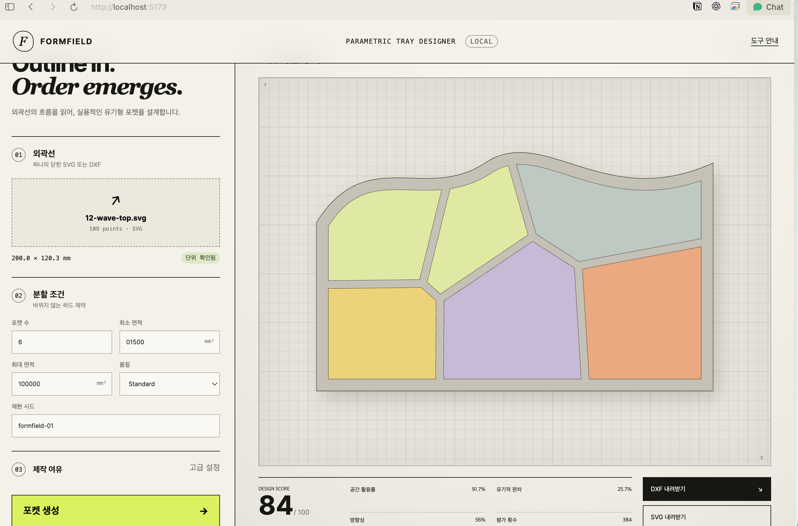
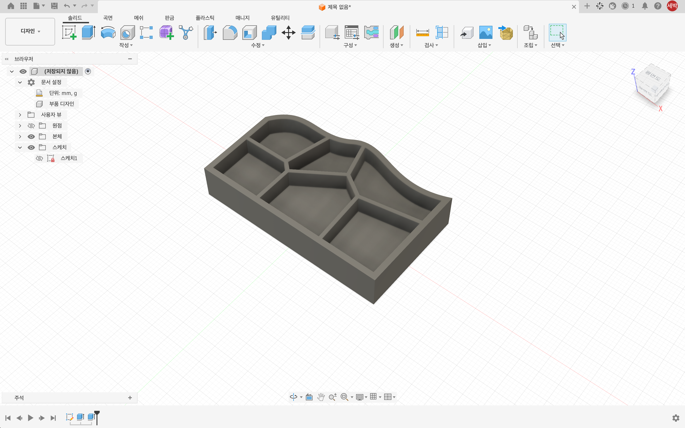
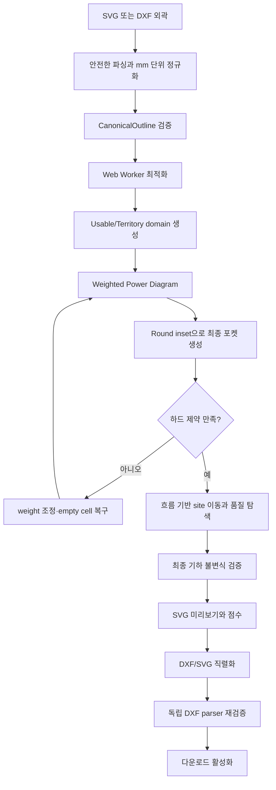

# Formfield — Parametric Tray Designer

사용자가 데스크 선반이나 트레이의 **2D 외곽선만 설계하면**, 내부의 포켓을 외곽 형상에 맞춰 자동으로 분할하고 SVG와 DXF로 내보내는 브라우저 기반 생성 설계 도구입니다.

이 프로젝트는 단순히 동일한 크기의 Voronoi 셀을 만드는 대신 다음 조건을 함께 다룹니다.

- 사용자가 지정한 정확한 포켓 수
- 모든 포켓에 공통으로 적용되는 최소·최대 면적
- 외곽 여백과 포켓 사이 웹(web) 폭
- 크기 차이가 있는 유기적인 면적 분포
- 외곽선의 흐름을 따르는 포켓 방향성
- 외곽 포함, 비겹침, 단일 연결 형상
- 같은 입력과 시드에서 같은 결과를 만드는 결정론적 생성
- 실제 DXF로 변환한 뒤에도 유지되는 제조용 2D 형상

모든 계산은 브라우저 안에서 수행됩니다. 로그인, 서버, 클라우드 저장, 3D 모델 생성 기능은 포함하지 않습니다.

> 이 프로그램은 독창적인 공간 분할을 보조하는 설계 도구이며, 디자인권이나 지식재산권 비침해 여부를 자동으로 판단하지 않습니다.

## 시연 및 Fusion 활용 예시

외곽선을 불러와 포켓을 생성하고 DXF로 내보내는 전체 과정은 아래 영상에서 확인할 수 있습니다.

**[▶ Formfield 시연 영상 보기 (MOV, 약 50초)](examples/formfield-workflow-demo.mov)**

Formfield에서 생성한 2D 포켓 레이아웃입니다.



내보낸 도면을 Fusion 스케치로 가져와 바로 3D 모델링한 트레이 예시입니다.



## 목차

- [시연 및 Fusion 활용 예시](#시연-및-fusion-활용-예시)
- [프로젝트 목표](#프로젝트-목표)
- [주요 기능](#주요-기능)
- [빠른 시작](#빠른-시작)
- [사용 방법](#사용-방법)
- [검증된 예제](#검증된-예제)
- [전체 작동 흐름](#전체-작동-흐름)
- [핵심 기하 모델](#핵심-기하-모델)
- [Weighted Power Diagram](#weighted-power-diagram)
- [수치 최적화 알고리즘](#수치-최적화-알고리즘)
- [유기성과 방향성 평가](#유기성과-방향성-평가)
- [하드 제약과 목적 함수](#하드-제약과-목적-함수)
- [입력 처리](#입력-처리)
- [DXF와 SVG 내보내기](#dxf와-svg-내보내기)
- [실패 처리](#실패-처리)
- [결정론과 재현성](#결정론과-재현성)
- [아키텍처](#아키텍처)
- [기술 스택과 선택 이유](#기술-스택과-선택-이유)
- [테스트와 검증](#테스트와-검증)
- [현재 범위와 한계](#현재-범위와-한계)

## 프로젝트 목표

일반적인 트레이 설계에서는 외곽 형상이 바뀔 때마다 디자이너가 내부 구획을 다시 그려야 합니다. Formfield는 이 반복 작업을 다음과 같이 바꾸는 것을 목표로 합니다.

```text
외곽 형상 설계
  → 포켓 수와 실용 면적 범위 입력
  → 알고리즘이 공간 분할과 미적 품질을 탐색
  → 검증된 2D 포켓 형상을 SVG/DXF로 출력
```

여기서 “최적화”는 전역 최적해를 수학적으로 보장한다는 뜻이 아닙니다. 동일한 입력, 파라미터, 시드, 알고리즘 버전과 평가 예산 안에서 탐색한 후보 중 **모든 하드 제약을 만족하면서 목적 함수가 가장 좋은 결과**를 선택한다는 의미입니다.

## 주요 기능

- SVG 또는 DXF로 작성된 단일 폐곡선 외곽 가져오기
- 단위가 없는 도면에 대해 `1 도면 단위 = ? mm` 배율 확인
- 포켓 수, 최소 면적, 최대 면적 설정
- 웹 폭과 외곽 여백 설정
- Draft, Standard, Extended 품질 프리셋
- 시드 기반의 재현 가능한 포켓 생성
- weighted power diagram 기반의 면적 균형
- 외곽 접선 흐름을 반영한 방향성 탐색
- 활용률, 면적 분포, 흐름, 형상 품질 점수 표시
- 브라우저 UI를 멈추지 않는 Module Web Worker 계산
- DXF와 SVG 출력
- 다운로드 전에 수행되는 독립 DXF 왕복 검증
- 원인이 구분된 실패 category와 reason code

## 빠른 시작

### 요구 환경

- Node.js `22.12.0` 이상
- npm
- 최신 Chromium 계열 브라우저 권장

### 설치 및 실행

```bash
npm install
npm run dev
```

Vite가 출력한 로컬 주소를 브라우저에서 엽니다.

### 프로덕션 빌드

```bash
npm run build
```

빌드 결과는 `dist/`에 생성됩니다. 애플리케이션은 별도 백엔드가 필요 없는 정적 웹 애플리케이션입니다.

## 사용 방법

1. 하나의 닫힌 외곽선이 들어 있는 SVG 또는 DXF를 업로드합니다.
2. 파일에 실제 길이 단위가 없으면 도면 단위와 mm의 관계를 입력하고 **배율 적용**을 누릅니다.
3. 생성할 포켓 수를 입력합니다.
4. 모든 포켓에 적용할 최소·최대 면적을 `mm²`로 입력합니다.
5. 품질 프리셋과 재현 시드를 선택합니다.
6. 필요하면 웹 폭과 외곽 여백을 조정합니다.
7. **포켓 생성**을 누릅니다.
8. 결과가 `VALIDATED`가 되면 SVG 또는 DXF를 내려받습니다.

### 주요 파라미터

| 파라미터 | 의미 | 기본값 |
| --- | --- | ---: |
| 포켓 수 `N` | 생성해야 하는 정확한 최종 포켓 수 | `6` |
| 최소 면적 `A_min` | 각 최종 포켓이 가져야 하는 최소 면적 | `900 mm²` |
| 최대 면적 `A_max` | 각 최종 포켓이 넘을 수 없는 최대 면적 | `2600 mm²` |
| 재현 시드 | 초기 배치와 유기적 목표 분포를 결정하는 문자열 | `formfield-01` |
| 웹 폭 `g` | 인접 포켓 사이에 남기는 재료 폭 | `4 mm` |
| 외곽 여백 `m` | 외곽선과 포켓 사이에 남기는 여백 | `6 mm` |
| 품질 | 평가 예산을 결정 | `Standard` |

외곽 여백은 웹 폭의 절반 이상이어야 합니다.

```text
m >= g / 2
```

알고리즘은 사용자가 입력한 포켓 수나 면적 범위를 자동으로 완화하지 않습니다. 조건을 만족하는 결과를 평가 예산 안에서 찾지 못하면 실패 원인과 함께 파라미터 수정을 요청합니다.

## 검증된 예제

`examples/`에는 실제 브라우저 E2E 테스트로 검증한 입력이 포함되어 있습니다.

`01-soft-rectangle.svg`부터 `20-starburst.svg`까지는 볼록형, 곡선형, 비대칭형, 오목형, 급각형을 망라하는 `240 × 160 mm` 테스트 코퍼스입니다. 각 파일은 Chromium에서 업로드, 3개 공간 분할, 검증 완료, DXF/SVG 내보내기 활성화까지 자동 검사합니다.

### `known-good-rectangle.svg`

| 항목 | 값 |
| --- | ---: |
| 포켓 수 | `3` |
| 최소 면적 | `300 mm²` |
| 최대 면적 | `5000 mm²` |
| 품질 | `Extended` |
| 시드 | `known-good-rectangle` |
| 웹 폭 | `4 mm` |
| 외곽 여백 | `6 mm` |

### `Vector 1.svg`와 `Ellipse 1.svg`

두 파일 모두 물리 단위가 없으므로 먼저 `1 도면 단위 = 1 mm`를 적용합니다.

| 항목 | 값 |
| --- | ---: |
| 포켓 수 | `6` |
| 최소 면적 | `900 mm²` |
| 최대 면적 | `10000 mm²` |
| 품질 | `Extended` |
| 시드 | `formfield-01` |
| 웹 폭 | `4 mm` |
| 외곽 여백 | `6 mm` |

더 자세한 예제 설명은 [`examples/README.md`](examples/README.md)를 참고하세요.

## 전체 작동 흐름



## 핵심 기하 모델

사용자에게 보이는 포켓은 power diagram의 원시 셀이 아니라, 제조 여유를 적용한 **최종 포켓**입니다.

기호를 다음과 같이 정의합니다.

```text
P = 입력 외곽선
m = outerMarginMm
g = webWidthMm
r = g / 2
```

세 종류의 영역을 구성합니다.

```text
U   = offset(P, -m)          최종 포켓이 들어갈 수 있는 usable domain
T   = offset(P, -(m-r))      power territory를 계산하는 territory domain
C_i = T와 교차된 i번째 raw power territory
Q_i = offset(C_i, -r)        실제 출력되는 i번째 최종 포켓
```

반드시 유지해야 하는 관계는 다음과 같습니다.

```text
Q_i ⊆ U ⊆ T ⊆ P
A_min <= area(Q_i) <= A_max
```

`T`에서 분할한 셀을 양쪽으로 `r = g/2`만큼 줄이기 때문에, 인접한 두 포켓 사이에는 목표 웹 폭 `g`가 남습니다. 외곽 쪽 포켓은 `U` 안에 제한되므로 입력 외곽과 `m`만큼의 여유를 갖습니다.

활용률은 원시 territory가 아니라 최종 포켓으로 계산합니다.

```text
utilization = area(union(Q_1, ..., Q_N)) / area(U)
```

모든 offset과 boolean 연산은 같은 `PocketGeometryService`와 같은 Clipper 커널 설정을 사용합니다. 이를 통해 미리보기, 점수, 검증, 내보내기가 서로 다른 형상을 판단하는 문제를 방지합니다.

## Weighted Power Diagram

기본 공간 분할에는 일반 Voronoi diagram을 확장한 weighted power diagram을 사용합니다.

각 site `s_i`는 위치와 weight `w_i`를 가집니다. 점 `x`에 대한 power distance는 다음과 같습니다.

```text
π_i(x) = ||x - s_i||² - w_i
```

점 `x`는 모든 다른 site보다 `π_i(x)`가 작거나 같은 셀에 속합니다.

```text
C_i = { x | π_i(x) <= π_j(x), 모든 j }
```

두 site 사이의 조건을 전개하면 선형 half-plane이 됩니다.

```text
2(s_j - s_i) · x
  <= ||s_j||² - w_j - (||s_i||² - w_i)
```

구현은 각 site에 대해 충분히 큰 사각형에서 시작해 다른 site가 만드는 half-plane으로 반복 clipping합니다. 만들어진 convex power cell을 실제 `T`와 Clipper boolean intersection하여 오목한 입력 외곽에도 맞춥니다.

### 일반 Voronoi 대신 power diagram을 사용한 이유

일반 Voronoi는 site 위치만으로 면적을 바꿔야 하므로 위치와 모양이 강하게 얽힙니다. Power diagram은 weight를 별도로 조절할 수 있어 다음 역할을 분리하기 쉽습니다.

- **weight**: 포켓 면적 균형과 최소·최대 면적 만족
- **site 위치**: 방향성, 형상 비율, 경계 흐름과 전체 미감 개선

weight가 커지면 해당 site의 territory가 확장되고, 작아지면 축소됩니다. 모든 weight에 같은 상수를 더해도 분할은 변하지 않으므로, 매 갱신 뒤 평균 weight를 0으로 맞춰 수치 drift를 방지합니다.

## 수치 최적화 알고리즘

### 1. 입력과 파라미터 검증

생성 전에 다음을 검사합니다.

- 포켓 수가 양의 정수인지
- 최소 면적이 0보다 큰지
- 최대 면적이 최소 면적 이상인지
- 웹 폭과 외곽 여백이 유효한지
- 좌표가 유한하고 외곽선이 단순 폐곡선인지
- 단위 또는 mm 배율이 확정되었는지

### 2. 수치 허용오차와 안전 면적 구간

곡선 평탄화, Clipper 좌표 양자화, DXF 반올림 후에도 사용자 면적 범위를 지키기 위해 내부 최적화에는 더 좁은 안전 구간을 사용합니다.

```text
exportGuard = max(areaTolerance, A_max × 0.001)
L_safe = A_min + exportGuard
H_safe = A_max - exportGuard
```

`L_safe > H_safe`이면 내보내기 안전 여유만으로 면적 구간이 소진된 것이므로 생성 전에 거부합니다.

현재 geometry kernel 좌표 정밀도는 소수점 4자리이며, 좌표 양자화 단위는 `0.0001 mm`입니다.

### 3. 결정론적 초기 site 배치

시드 문자열과 입력 외곽 digest를 결합해 난수열을 만듭니다.

```text
randomSeed = userSeed + "|" + outlineDigest
```

초기 후보는 최대 세 방식으로 구성합니다.

1. jittered grid 후보 중 farthest-point 방식으로 간격을 벌린 기본 배치
2. 별도 결정론적 난수열을 사용한 대체 farthest-point 배치
3. 중심의 외곽 흐름과 비스듬히 교차하는 축을 따라 놓는 flow-biased 배치

하드 제약을 이미 만족하는 초기 후보가 있으면 territory 중심으로 한 번 이동하는 centroidal relaxation도 평가합니다.

### 4. 유기적인 목표 면적 생성

모든 포켓을 같은 면적으로 만들지 않고, 안전 구간 안에서 크기 차이가 생기도록 목표 면적 벡터를 만듭니다.

```text
raw_i = 1 + 0.34 × sin(phase + i × 2.399963...)
```

`2.399963... rad`는 황금각에 가까운 위상 간격입니다. 목표 합계를 현재 가능한 전체 포켓 면적에 맞춘 뒤 각 값을 `[L_safe, H_safe]`에 clamp하고, 남은 면적 차이를 아직 여유가 있는 셀에 반복 재분배합니다.

이 분포는 포켓 크기에 리듬을 만들면서 특정 순서로 큰 셀이 몰리는 현상을 줄입니다.

### 5. Hard-first weight balancing

각 후보를 평가할 때 최종 포켓 `Q_i`의 실제 면적을 사용합니다. 원시 power territory 면적을 대신 사용하지 않습니다.

면적 residual은 하드 제약을 우선하도록 계산합니다.

```text
area_i < L_safe  → residual_i = L_safe - area_i
area_i > H_safe  → residual_i = H_safe - area_i
그 외             → residual_i = target_i - area_i
```

안전 구간 안의 목표 residual은 한 번에 지나치게 큰 변화가 생기지 않도록 제한됩니다. Weight 갱신은 셀 하나의 특성 면적인 `usableArea / N`으로 정규화합니다.

후보 비교 순서는 다음과 같은 사전식 우선순위입니다.

1. 하드 제약을 위반한 포켓 수
2. 하드 제약 위반량의 합
3. 유기적 면적 변동 범위 충족 여부
4. 목적 함수 비용
5. 목표 면적 residual

따라서 미적으로 더 좋아 보여도 면적 하드 제약을 더 많이 위반하는 후보는 선택되지 않습니다.

### 6. Topology epoch와 empty cell 복구

Weight 변화로 territory가 사라지거나 여러 조각으로 나뉠 수 있습니다. 구현은 다음 정보를 해시한 topology signature를 추적합니다.

- site별 territory component 수
- 최종 포켓 상태
- territory 사이의 인접 관계

Topology가 변하거나 전체 포켓 면적이 크게 drift하면 목표 면적을 다시 구성합니다.

포켓이 사라지면 가장 큰 territory 내부에서 기존 site들과 가장 멀리 떨어진 점을 격자 탐색으로 찾아 실패한 site를 옮깁니다. Weight는 중앙값으로 복구한 뒤 다시 평균을 0으로 맞춥니다. 복구 횟수는 제한되어 있으므로 무한 반복하지 않습니다.

### 7. 외곽 흐름 기반 site 탐색

면적 하드 제약을 만족한 뒤에는 site를 외곽 흐름 방향 또는 그 수직 방향으로 조금씩 움직여 형태와 방향성을 개선합니다.

- 이동 크기: territory domain 대각선의 약 `2.5%`
- 이동 방향: 지역 flow 방향과 수직 방향을 번갈아 사용
- 이동 부호: 시드 기반 결정론적 선택
- domain 밖으로 나가는 이동: 즉시 거부

하드 제약이 악화되는 이동은 허용하지 않습니다. 동일한 hard rank 안에서는 평가가 진행될수록 낮아지는 temperature를 사용하는 제한적 annealed acceptance로 국소해 탈출을 시도합니다.

마지막에는 각 site를 상·하·좌·우로 움직이는 coordinate hill climb를 수행합니다. 초기 step은 domain 대각선의 `2%`이며 개선이 없을 때 절반으로 줄여 `0.1%`까지 탐색합니다.

### 8. 평가 예산과 종료

품질 프리셋은 셀 수에 비례하는 최대 평가 횟수를 결정합니다.

| 품질 | 기본 평가 예산 |
| --- | ---: |
| Draft | `max(48, 24 × N)` |
| Standard | `max(48, 64 × N)` |
| Extended | `max(48, 144 × N)` |

고정된 예산 덕분에 같은 입력을 재생성할 수 있고, 탐색이 끝나지 않는 상황을 방지할 수 있습니다. 예산 안에서 하드 제약을 만족하지 못한 경우는 “수학적으로 불가능”이 아니라 `SEARCH_EXHAUSTED`로 보고합니다.

## 유기성과 방향성 평가

### 유기적인 크기 차이

포켓 면적의 변동계수(coefficient of variation)를 사용합니다.

```text
CV = standardDeviation(area_i) / mean(area_i)
```

현재 목표 organic band는 다음과 같습니다.

```text
0.18 <= CV <= 0.35
```

이 범위보다 균일하면 인위적으로 반복되는 느낌을, 너무 크면 실용성이 무너지는 과도한 편차를 비용으로 부과합니다.

### 외곽 흐름장

외곽선을 균일하게 샘플링하고 각 샘플의 단위 접선 `t_k`를 구합니다. 포켓 중심 `x` 주변의 접선들을 Gaussian weight로 모아 2×2 structure tensor를 구성합니다.

```text
M(x) = Σ exp(-||x-p_k||² / (2σ²)) × t_k t_kᵀ
```

가장 큰 고유값의 고유벡터가 해당 위치에서 지배적인 외곽 흐름 방향입니다. 신뢰도는 고유값 차이로 계산합니다.

```text
confidence = (λ₁ - λ₂) / (λ₁ + λ₂ + ε)
```

원형에 가까워 방향을 정하기 어려운 위치에서는 신뢰도가 낮아집니다.

### 포켓 주축과 흐름 정렬

포켓 꼭짓점의 covariance로 포켓 주축을 계산합니다. 방향의 앞뒤는 동일하므로 외곽 흐름과의 정렬도는 절댓값을 사용합니다.

```text
alignment = |pocketAxis · flowDirection|
flowLoss = 1 - alignment²
```

포켓 주축 신뢰도가 `0.05` 미만이거나 flow confidence가 `0.2` 미만이면 방향성 평가에서 제외합니다. 명확한 방향이 없는 원형 포켓을 임의 방향으로 유도하지 않기 위한 처리입니다.

## 하드 제약과 목적 함수

### 하드 제약

성공 결과는 다음 조건을 모두 만족해야 합니다.

- 최종 포켓 수가 정확히 `N`
- 각 포켓이 단일 연결 polygon
- 각 포켓에 hole이 없음
- 각 포켓 외곽이 self-intersection을 갖지 않음
- 모든 포켓이 usable domain `U` 안에 포함됨
- 포켓끼리 내부 영역이 겹치지 않음
- 모든 포켓 면적이 안전 구간 안에 있음
- DXF 왕복 후 사용자 면적 구간 안에 있음

### 소프트 목적 함수

하드 제약을 만족하는 후보끼리는 다음 비용을 최소화합니다.

```text
J = 0.35 × unusedCost
  + 0.20 × areaProfileCost
  + 0.20 × flowCost
  + 0.15 × shapeCost
  + 0.05 × cornerCost
  + 0.05 × boundaryCost
```

| 비용 | 의미 |
| --- | --- |
| `unusedCost` | `1 - utilization`, 사용하지 못한 usable area |
| `areaProfileCost` | 유기적 목표 면적과의 차이 + CV band 위반 |
| `flowCost` | 포켓 주축과 외곽 흐름의 불일치 |
| `shapeCost` | 지나치게 둥글거나 길쭉한 비율과 낮은 compactness |
| `cornerCost` | 60°보다 날카로운 꼭짓점 비율 |
| `boundaryCost` | 현재 구현에서 경계 흐름 불일치를 한 번 더 반영 |

현재 형상 점수는 약 `1.2–2.75` 범위의 aspect ratio를 선호하고, `3.5`를 넘으면 `HIGH_ASPECT_RATIO` 경고를 추가합니다. 면적과 둘레로 추정한 최소 폭이 매우 작으면 `NARROW_POCKET` 경고를 추가합니다. 이 경고들은 소프트 품질 신호이며 단독으로 결과를 거부하지 않습니다.

## 입력 처리

### SVG

지원하는 contour 요소:

- `path`
- `polygon`
- 닫힌 `polyline`
- `rect`
- `circle`
- `ellipse`

지원하는 path command:

- `M`, `L`, `H`, `V`
- `Q`, `T`
- `C`, `S`
- `A`
- `Z`

`path`는 `Z`로 명시적으로 닫혀 있어야 합니다. Quadratic/Cubic Bézier는 De Casteljau 적응 분할로, 원과 타원 및 arc는 sagitta 오차 기준으로 다각형화합니다. 목표 물리 평탄화 허용오차는 기본 `0.02 mm`이며 transform의 최대 singular value를 고려해 source-space tolerance를 조정합니다.

SVG 길이 단위는 `mm`, `cm`, `in`/`inch`/`inches`, `px`, `pt`, `pc`를 지원합니다. `width`와 `height`에 서로 다른 단위가 선언되면 거부합니다.

보안을 위해 다음 요소와 속성은 거부합니다.

- `script`, `use`, `image`, `text`, `filter`, `mask`
- animation 요소와 `foreignObject`
- 이벤트 속성
- 외부 `href`와 `url(...)`
- 알 수 없는 XML namespace
- 복수 외곽선과 입력 hole

SVG 파일 크기 제한은 `5 MB`입니다.

### DXF

지원하는 2D ASCII entity:

- 닫힌 `LWPOLYLINE`과 bulge
- legacy `POLYLINE`
- `CIRCLE`
- 회전되지 않은 축 정렬 `ELLIPSE`
- 순서화되고 닫힌 `LINE`/`ARC` chain

지원 단위:

- millimetre
- centimetre
- metre
- inch
- feet

`$INSUNITS`가 없으면 단위를 추측하지 않고 사용자가 mm 배율을 확인할 때까지 생성을 막습니다. 복수 외곽, 3D entity, `INSERT` 등 지원 계약 밖의 입력은 명시적인 오류로 거부합니다.

DXF 파일 크기 제한은 `10 MB`입니다.

## DXF와 SVG 내보내기

### DXF

DXF는 다음 계약으로 생성됩니다.

- AutoCAD R2000 ASCII (`AC1015`)
- `$INSUNITS = 4`, 즉 millimetre
- 닫힌 `LWPOLYLINE`
- `OUTLINE` layer에 원본 외곽 1개
- `POCKET` layer에 최종 포켓 `N`개
- 중간 power territory와 보조선은 제외

### SVG

SVG 역시 같은 최종 외곽과 포켓 polygon을 사용합니다. 미리보기와 내보내기가 서로 다른 기하를 재계산하지 않습니다.

### 독립 DXF 왕복 검증

다운로드 전에 출력된 DXF 문자열을 production importer와 다른 작은 group-code parser로 다시 읽습니다. 다음을 모두 통과해야 다운로드 버튼이 활성화됩니다.

- DXF 구조와 mm 단위 선언
- 외곽 1개와 정확한 포켓 수
- 모든 polyline의 폐합 여부와 유한 좌표
- 사용자 최소·최대 면적 범위
- 내보내기 전후 면적 변화 `0.1%` 이하
- usable domain 포함
- 포켓 간 비겹침

포함 판정은 실제 이탈과 Clipper의 소수 좌표 양자화 오차를 구분합니다. usable boundary와 포켓이 서로 다른 kernel 연산에서 만들어지는 점을 고려해 최대 상대 2D 반올림 변위인 `2√2 × coordinateQuantum`을 허용합니다. 현재 값은 약 `0.000283 mm`이며, 이보다 큰 실제 이탈은 계속 거부됩니다.

## 실패 처리

실패는 단순한 “생성 실패” 한 종류로 처리하지 않습니다.

| Category | 의미 |
| --- | --- |
| `INVALID_PARAMETERS` | 사용자 파라미터 자체가 유효하지 않음 |
| `UNSUPPORTED_CONFIGURATION` | 입력은 읽었지만 현재 제품 계약으로 처리할 수 없음 |
| `INVALID_GEOMETRY` | 외곽이나 최종 기하 불변식이 잘못됨 |
| `PROVEN_INFEASIBLE` | 현재 조건이 수치적으로 불가능함을 사전 증명함 |
| `SEARCH_EXHAUSTED` | 평가 예산 안에서 유효한 후보를 찾지 못함 |
| `EXPORT_PRECISION_FAILURE` | 내보내기 왕복 과정에서 계약이 깨짐 |

대표 reason code:

- `PARAM_N_NOT_POSITIVE_INTEGER`
- `PARAM_MAX_AREA_BELOW_MIN`
- `PARAM_MARGIN_BELOW_HALF_WEB`
- `CFG_PHYSICAL_UNIT_REQUIRED`
- `CFG_OFFSET_DOMAIN_MULTI_COMPONENT`
- `CFG_EXPORT_GUARD_EXHAUSTS_AREA_INTERVAL`
- `GEOM_OPEN_CONTOUR`
- `GEOM_SELF_INTERSECTION`
- `FEASIBLE_MIN_AREA_CAPACITY_EXCEEDED`
- `FEASIBLE_SINGLE_POCKET_AREA_OUT_OF_RANGE`
- `SEARCH_EMPTY_CELL_RECOVERY_EXHAUSTED`
- `SEARCH_TOPOLOGY_INSTABILITY`
- `SEARCH_AREA_INTERVAL_NOT_REACHED`
- `EXPORT_ROUNDTRIP_CONTAINMENT_FAILED`
- `EXPORT_ROUNDTRIP_OVERLAP_DETECTED`

특히 `SEARCH_EXHAUSTED`는 조건이 절대 불가능하다는 뜻이 아닙니다. 품질 프리셋을 높이거나 포켓 수, 면적 범위, 웹 폭, 외곽 여백을 조정하면 결과가 달라질 수 있습니다.

## 결정론과 재현성

성공 결과에는 다음 메타데이터가 포함됩니다.

- 입력 digest와 canonical geometry digest
- 사용자 시드
- 알고리즘 ID와 버전
- geometry kernel ID와 버전
- 입력 계약, canonicalization, 목적 함수 버전
- 평가 예산
- tolerance policy
- 좌표 정규화 값과 정수 좌표 scale
- DXF export 소수 정밀도
- 최종 result hash

시드 난수 생성기와 stable hash는 프로젝트 내부 구현을 사용합니다. 동일한 환경에서 입력, 파라미터, 시드, 알고리즘 버전과 예산이 같으면 같은 탐색 순서와 결과를 재생성할 수 있습니다.

## 아키텍처

```text
src/
├── app/
│   ├── App.tsx                 전체 UI workflow와 export gate
│   ├── engineAdapter.ts        CanonicalOutline 생성과 Worker 연결
│   └── reducer.ts              명시적 화면 상태 전이
├── core/
│   ├── optimize.ts             전체 최적화 루프와 점수 함수
│   ├── powerDiagram.ts         weighted power cell과 topology signature
│   ├── boundaryFlow.ts         외곽 접선 기반 방향장
│   ├── pocketGeometry.ts       U/T/Q 생성과 포함 판정
│   ├── kernel.ts               Clipper2 geometry adapter
│   ├── geometry.ts             면적, 중심, clipping, 교차 등 순수 기하 함수
│   ├── failures.ts             파라미터 검증과 실패 모델
│   ├── random.ts               시드 난수와 결정론적 hash
│   └── types.ts                canonical domain 계약
├── io/
│   ├── svg/                    SVG whitelist, path parsing, flattening, export
│   ├── dxf/                    제한된 DXF import와 R2000 export
│   ├── units.ts                물리 단위 변환
│   └── types.ts                import 단계 DTO
├── ui/                         입력, 파라미터, 미리보기, 진단, export UI
├── verification/dxf/           production importer와 독립된 DXF 검증기
└── worker/                     Module Worker protocol과 optimizer 실행
```

### 데이터 흐름

```text
File
 → importOutline()
 → ImportedOutline
 → confirmScale()
 → CanonicalOutline
 → GenerationRequest
 → optimizer.worker.ts
 → generateTray()
 → GenerationSuccess | GenerationFailure | GenerationCancelled
 → Preview / Diagnostics / Score
 → exportDxf() + verifyExportedDxf()
 → Download
```

UI는 기하 계산의 권위 소스가 아닙니다. 최적화 Worker가 반환한 최종 polygon을 미리보기와 exporter가 그대로 소비합니다.

## 기술 스택과 선택 이유

| 기술 | 역할 | 선택 이유 |
| --- | --- | --- |
| React 19 | UI | 입력·진행·성공·실패 상태를 명확히 표현 |
| TypeScript 5.9 strict mode | 전체 구현 | geometry DTO와 Worker protocol의 타입 안정성 |
| Vite 7 | 개발·빌드 | 정적 앱과 Module Worker를 단순하게 구성 |
| `clipper2-ts@2.0.1-18` | offset, intersection, union | 오목 polygon과 정수 양자화 기반 boolean 연산 |
| Web Worker | 최적화 실행 | 계산 중 메인 UI thread의 응답성 유지 |
| native SVG | 미리보기 | 최종 polygon을 변환 계층 없이 직접 표시 |
| 내부 DXF parser/writer | 2D DXF 입출력 | 지원 범위와 실패 코드를 좁고 결정론적으로 관리 |
| Vitest | 단위·통합·속성 테스트 | 순수 TypeScript 알고리즘을 빠르게 검증 |
| Playwright | 브라우저 E2E·성능 | 실제 파일 업로드, Worker, 다운로드 흐름 검증 |

### 브라우저 로컬 구조를 선택한 이유

- 사용자의 설계 파일을 서버로 전송하지 않음
- 계정과 백엔드 운영이 필요 없음
- 정적 호스팅만으로 배포 가능
- TypeScript DTO를 importer, optimizer, Worker, UI가 공유 가능

### Clipper2를 선택한 이유

이 프로젝트의 핵심은 단순한 선 교차가 아니라 오목 외곽에 대한 negative offset, boolean intersection, union, component 보존입니다. 이를 직접 구현하는 대신 검증된 polygon kernel을 얇은 adapter 뒤에 고정해 제품 고유 알고리즘과 기하 커널 책임을 분리했습니다.

### 좁은 DXF 구현을 선택한 이유

범용 CAD 모델 전체를 지원하면 블록, 3D transform, 다양한 spline과 entity 의미론까지 제품 범위에 들어옵니다. 현재 목적은 단일 2D 외곽 입력과 최종 2D 포켓 출력이므로, 지원 entity를 명시적으로 제한한 parser/writer가 실패를 더 예측 가능하게 만듭니다.

### 비등방성 metric을 도입하지 않은 이유

방향성 코퍼스의 초기 실패는 등방성 power diagram의 표현력 부족이 아니라, 서로 다른 포함 허용오차를 사용하던 수치 판정 문제였습니다. 포함 판정을 같은 geometry service로 통일한 뒤 6개 방향성 fixture가 모두 하드 제약, 흐름 정렬, 유기성 기준을 통과했습니다. 따라서 현재는 불필요한 affine warp나 anisotropic metric을 추가하지 않습니다.

자세한 결정 기록은 [`docs/adr/ADR-002-containment-before-anisotropy.md`](docs/adr/ADR-002-containment-before-anisotropy.md)를 참고하세요.

### 작업 기록과 새 세션 인계

새 개발 세션은 [`AGENTS.md`](AGENTS.md), [`docs/HANDOFF.md`](docs/HANDOFF.md), 최신 [`docs/worklog/`](docs/worklog/) 기록, 관련 ADR 순서로 읽습니다. `.omx/`는 로컬 런타임 상태와 원시 JSONL 로그이므로 Git에 보존하지 않고, 재사용할 결정·변경·검증 결과만 Markdown 작업 기록으로 정리합니다.

## 테스트와 검증

### 검증 명령

```bash
# 전체 Vitest 테스트
npm test

# 정적 검사
npm run lint
npm run typecheck

# 프로덕션 빌드
npm run build

# 실제 Chromium E2E
npm run test:e2e

# 영역별 테스트
npm run test:integration
npm run test:properties
npm run test:algorithm-viability
npm run test:independent-dxf
npm run test:fixtures

# 성능 benchmark
npm run benchmark
```

### 테스트 계층

| 계층 | 검증 대상 |
| --- | --- |
| Unit | 수학 함수, parser, parameter validation, reducer, protocol |
| Integration | U/T/Q 의미론, optimizer, 예제 파일, bounded throughput |
| Property/Metamorphic | 이동·회전·scale 불변성과 결정론 |
| Algorithm viability | 극단 종횡비, 방향성 코퍼스, golden preview |
| Independent DXF | production importer와 독립된 왕복 검증 |
| Browser | DOM/Worker structured clone 경계 |
| Playwright E2E | 실제 업로드부터 DXF/SVG 다운로드 활성화까지 |
| Performance | 평가 처리량, 취소 응답, progress cadence, main-thread long task |

현재 기준으로 다음 검증을 통과했습니다.

- Vitest: `23`개 test file, `161/161` 테스트 통과
- Chromium Playwright: `32/32` 테스트 통과
- ESLint 통과
- TypeScript typecheck 통과
- Vite production build 통과

특히 `Vector 1.svg`, `Ellipse 1.svg`, 급격한 V자 오목 외곽 fixture와 20개 외곽선 코퍼스는 실제 브라우저에서 업로드, 공간 분할, `VALIDATED`, DXF/SVG 다운로드 활성화까지 테스트합니다.

## 현재 범위와 한계

### 지원 범위

- 하나의 단순한 2D 폐곡선 외곽
- hole이 없는 단일 연결 포켓
- SVG/DXF 2D 입력
- SVG/DXF 2D 출력
- 포켓 수와 공통 최소·최대 면적
- 외곽 여백과 포켓 사이 웹 폭

### 포함하지 않는 기능

- 로그인, 계정, 클라우드 동기화
- 협업과 버전 관리 UI
- 3D 모델, STL, STEP
- 포켓 깊이, 바닥 경사, 필렛, 드래프트 각
- CNC toolpath 또는 CAM 생성
- 수동 포켓 편집
- 입력 hole, 복수 외곽, 섬 형상
- 모든 DXF entity와 모든 CAD 프로그램 호환성 보장
- 전역 최적해 보장
- 디자인권 비침해 자동 판정

### 알고리즘상 주의점

- 매우 좁은 neck이나 큰 웹 폭은 offset domain을 여러 조각으로 만들 수 있습니다.
- `N × A_min`이 usable area보다 크면 수학적으로 생성할 수 없습니다.
- 지나치게 좁은 면적 범위는 DXF 안전 여유 때문에 거부될 수 있습니다.
- `SEARCH_EXHAUSTED`는 해가 없다는 증명이 아니므로 Extended 품질이나 다른 시드를 시도할 가치가 있습니다.
- 단위 없는 파일에 잘못된 mm 배율을 적용하면 모든 면적과 제조 치수가 잘못됩니다.

## 관련 문서

- [검증된 입력 예제](examples/README.md)
- [기하 fixture 계약](tests/fixtures/README.md)
- [Containment before anisotropy ADR](docs/adr/ADR-002-containment-before-anisotropy.md)
- [Golden preview review](docs/verification/golden-previews/REVIEW.md)
